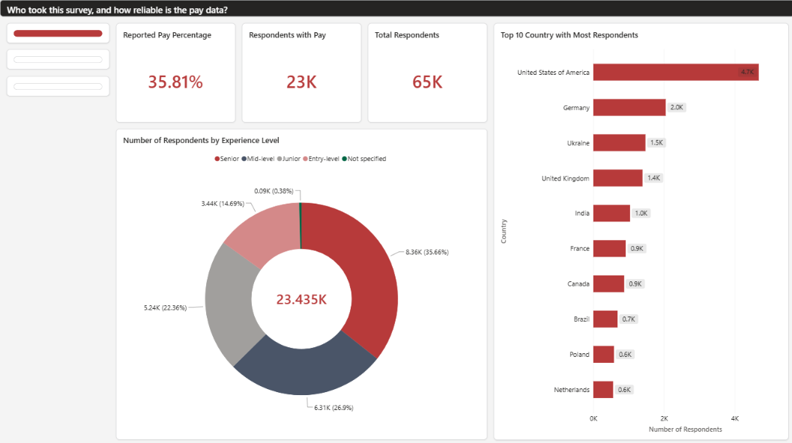
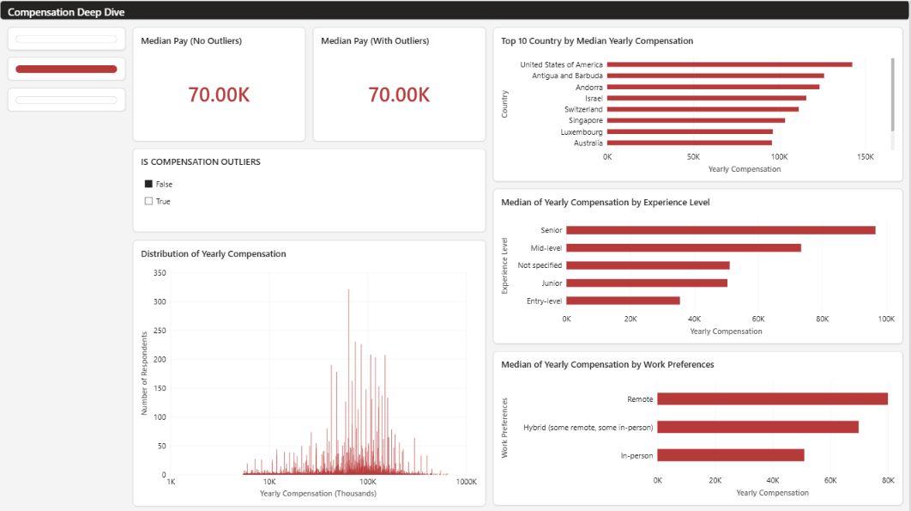
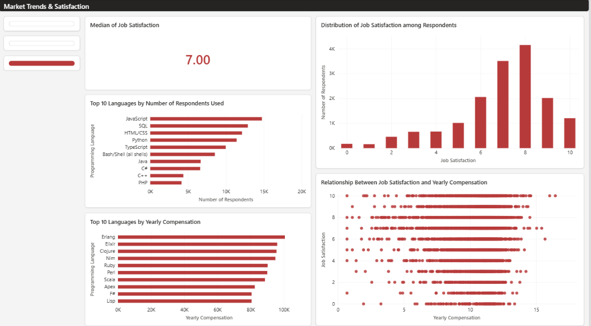

# Phase 4: Reporting (Findings & Power BI Dashboard)

**Project:** Developer Market Trends & Salary Drivers

I bring the results of Phase 1-3 together here. I answer the 5 research questions from
Phase 1, list the other insights I found along the way, and show the Power BI dashboard
that presents them.

## Power BI Dashboard

The dashboard has 3 pages. Page 1 shows who answered and how much pay data I have. Page 2
shows pay by country, experience level, and work preference. Page 3 shows language trends
and job satisfaction.

- Page 1 counts only the 23,435 respondents who reported pay, so its country and
  experience numbers are smaller than the Phase 2 profile (all 65,437).
- Page 2 is filtered to `IS COMPENSATION OUTLIERS = False`, so both median cards show
  70.00K. The $65,000 median with outliers comes from Phase 2.

## Answers to the Research Questions

### 1. Data quality: Who took the survey? How reliable is the pay data (about 64% missing)?

**Answer:** Most respondents are senior or mid-level developers from a few countries. The
pay data is usable but thin: only about a third of respondents reported it.

- 64.19% did not report pay. 23,435 respondents (35.81%) did (Phase 2, Section 2).
- Top 5 countries, all respondents: United States (11,095), Germany (4,947), India
  (4,231), United Kingdom (3,224), Ukraine (2,672).
- Experience, all respondents: Senior 18,460, Mid-level 12,653, Junior 10,834, Entry-level
  9,663.
- Dashboard page 1 (pay subset only): Senior 8.36K (35.66%), Mid-level 6.31K (26.9%),
  Junior 5.24K (22.36%), Entry-level 3.44K (14.69%).

### 2. Income distribution: How is pay spread out? How do I find outliers?

**Answer:** Pay is very skewed to the right, so I flagged outliers with IQR on the log
scale. This flagged 1,723 respondents (7.35%).

| Method | Lower bound | Upper bound | Outliers flagged |
| --- | --- | --- | --- |
| 3-sigma (raw) | -474,116 | 646,426 | 89 |
| IQR (raw) | -80,177 | 220,861 | 978 |
| **IQR (log)** | 5,454 | 647,443 | **1,723 (7.35%)** |

Skewness is 52.92 on the raw value and -2.26 after the log-transform (Phase 1). Median pay
is $65,000 with outliers and $70,000 without (Phase 2, Section 3).

### 3. Salary drivers: How do country, experience, education, job type, and remote work affect pay?

**Answer:** Country matters most. Experience and remote work also matter. I could not test
job type (`DevType`) against pay, so there is not enough data to conclude on it.

- **Model (Phase 3):** adding categorical features raised R² from 0.169 (`WorkExp` only) to
  0.537. Compared with Brazil, United States (+1.54), Canada (+1.10), United Kingdom
  (+1.02), and Germany (+0.91) have the largest country effects (log scale).
- **Experience:** `ExperienceLevel_ordinal` has a coefficient of +0.244 (Phase 3).
- **Education:** `EdLevel_Master's degree` (+0.21) and `EdLevel_Professional/Doctoral degree`
  (+0.19) are small positive coefficients. Group medians are in Phase 2, Section 4.
- **Employment:** Phase 2 shows pay differences by group, but I don't trust the Phase 3
  `Employment` coefficients (see "Limits").

| Remote work | Phase 2 median (with outliers) | Dashboard median (no outliers, read from chart) |
| --- | --- | --- |
| Remote | $75,000 (n=9,591) | about 80K |
| Hybrid | $66,592 (n=9,907) | about 70K |
| In-person | $44,586 (n=3,937) | about 51K |

On the dashboard, median pay by experience level is about 96K (Senior), 73K (Mid-level),
50K (Junior), and 35K (Entry-level) [cần xác nhận: values read from the chart].

### 4. Market trends: Which languages are most used? Most wanted? Highest paid?

**Answer:** JavaScript is the most used. Rust and Go show the biggest rise in interest.
The highest-paid languages are less common ones like Erlang and Elixir.

- **Most used (worked with):** JavaScript 62.75%, HTML/CSS 53.25%, Python 51.42%, SQL
  51.35%, TypeScript 38.75%.
- **Most wanted:** among these top-10 languages, Python leads (44.93%).
- **Biggest Want-vs-Have gap:** Rust (+18.26 pp), Go (+11.26 pp), Zig (+5.50 pp), Kotlin
  (+3.75 pp), Elixir (+3.11 pp).
- **Highest median pay (n >= 30):** Erlang $100,636 (n=229), Elixir $96,000 (n=598),
  Clojure $95,541 (n=350), Nim $94,924 (n=34), Ruby $90,221 (n=1,372).

The dashboard's top-10 pay chart matches this list. Its top-10 "used" chart ranks SQL above
HTML/CSS and includes PHP, unlike Phase 2 [cần xác nhận: likely because it counts only the
pay subset].

### 5. Income-satisfaction link: Does job satisfaction go up with pay and experience?

**Answer:** Only a little. The link is positive but weak for both pay and experience.

- `JobSat` vs. `ConvertedCompYearly_log`: Pearson r = 0.080, Spearman r = 0.103 (n=16,075).
- `YearsCodePro_num` vs. `JobSat`: Pearson r = 0.104, Spearman r = 0.119.
- Most people rate their job positively. The mode is 8/10 (Phase 2, Section 7).
- Dashboard page 3: the scatter shows points across all pay levels at every satisfaction
  score, with no clear upward trend. The x-axis looks like log pay [cần xác nhận].

## Insights Across the Phases

**Phase 1**
- Only 10 duplicate rows existed (65,447 to 65,437). Pay was the real data quality issue:
  `CompTotal` is missing 48.44% and `ConvertedCompYearly` 64.19%, too high to fill, so I
  left them as `NaN`.
- I mode-filled `RemoteWork` (16.25% missing) and `CodingActivities` (16.77%). The results
  that use these columns depend a bit on that choice.

**Phase 2**
- Raw outlier rules give a negative lower bound for pay, so they don't work here. Removing
  outliers moves the median up by $5,000.
- I flagged the imputed rows: 10,631 `RemoteWork` values. This lets me check how much they
  matter later.
- `Age_num` and `WorkExp` have r = 0.85, so Phase 3 uses only `WorkExp`.
- `DevType` and `Industry` are single-select (0 multi-value rows). Top values: Developer,
  full-stack (18,260) and Software Development (11,918).
- `JobSat` is missing for 55.49%, so the satisfaction results cover less than half of all
  respondents.

**Phase 3**
- MAE is about $31,535 in dollars. The model is good for comparing factors, not for setting
  salaries.
- I only used 15,011 rows (64.1% of the pay subset) after removing outliers and missing
  features.

**Phase 4**
- Country medians on the dashboard have no minimum sample size. Small countries like
  Antigua and Barbuda and Andorra rank high, behind the United States (about 143K)
  [cần xác nhận: their sample sizes].

## Conclusion and Recommendations

- Compare pay within the same country. Country is the biggest factor I found.
- Use the median, and flag outliers, when you report developer pay. The data is very
  skewed.
- Don't pick a language by pay alone. The highest-paid languages are less common, and I
  can't show that learning one raises pay.
- Don't expect a higher salary to mean a happier developer. The link is weak (r = 0.080).
- Use the model to compare factors, not to predict one person's salary.

## Limits

- The model has no p-values or confidence intervals, and I used one train/test split only.
- The country effect likely mixes real pay gaps with cost-of-living gaps, because pay is
  in USD and not adjusted.
- The Phase 3 `Employment` coefficients are hard to read (no reference group, multi-select
  field).
- Language, industry, and company size are not in the model, so a large part of pay
  differences stays unexplained (R² = 0.537).
- I did not check if the rows dropped before modeling are different from the rest.

## Project Structure

| Phase | Folder |
| --- | --- |
| 1. Data Wrangling | [`Phase 1/`](../Phase%201/) |
| 2. EDA | [`Phase 2/`](../Phase%202/) |
| 3. Modeling | [`Phase 3/`](../Phase%203/) |
| 4. Reporting (this folder) | [`Phase 4/`](./) |

- `images/` - dashboard screenshots.
- `model_summary.csv`, `model_coefficients.csv` - Phase 3 results, typed by hand for the
  dashboard.
